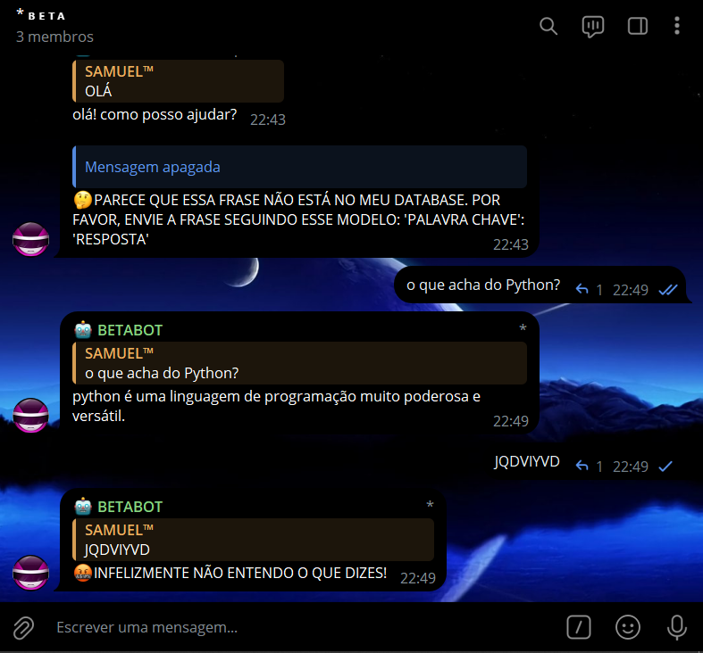
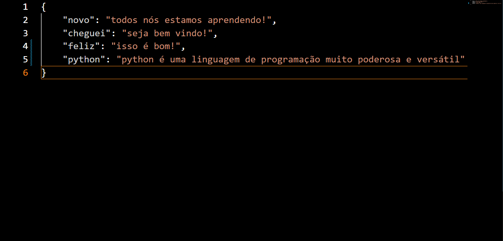
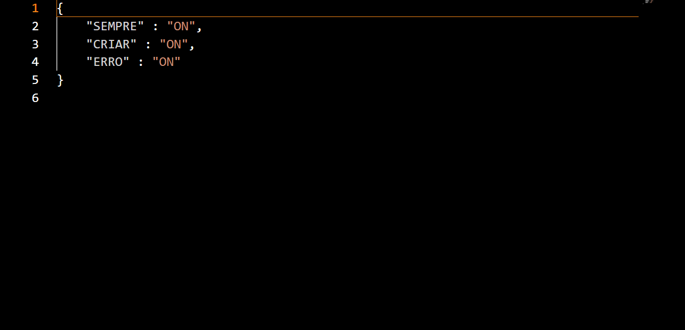

# CONVERSADOR LIVRE BOT
🛑BOT DO TELEGRAM QUE CONVERSA NO GRUPO. MUITO SEMELHANTE AO ROBÔ ED.

 <br>
 <br>
 <br>

## DESCRIÇÃO:
Este bot é um assistente virtual básico projetado para interagir com os usuários de forma eficiente. Ao ser iniciado, o bot carrega automaticamente dois arquivos essenciais: "WORD.json" e "CONFIG.json". O arquivo "WORD.json" contém uma lista de palavras-chave e suas respostas correspondentes, permitindo que o bot responda a uma variedade de perguntas comuns e forneça informações úteis aos usuários. 

Por sua vez, o arquivo "CONFIG.json" define o comportamento do bot. Nele, as configurações podem ser ajustadas conforme necessário para personalizar a interação. 

O bot é capaz de compreender palavras-chave em uma frase completa, o que significa que não é necessário que a mensagem do usuário consista apenas na palavra-chave, mas pode ser uma parte dela dentro de uma frase. 

1. **Respostas a Perguntas Básicas:**
   - O bot pode responder a uma variedade de perguntas básicas, como nome, como está, o que pode fazer, entre outras.
   - Ele também pode fornecer piadas, curiosidades e recomendações sobre uma variedade de tópicos.

2. **Gerenciamento de Respostas:**
   - Se uma mensagem do usuário não corresponder a nenhuma resposta pré-definida, o bot pode solicitar ao usuário que forneça uma resposta para ser adicionada ao banco de dados.
   - Essa funcionalidade é controlada pelas configurações no arquivo "CONFIG.json".

3. **Erro de Mensagem não Compreendida:**
   - Se o bot não entender a mensagem do usuário, ele enviará uma mensagem indicando que não compreendeu e oferecerá orientações para reenviar a mensagem seguindo um formato específico.

## PROCEDIMENTO DE COMPRA:
- Para efetuar a compra, por favor, entre em contato comigo por mensagem privada, informando:
    ```bash
    Gostaria de adquirir o bot: https://github.com/VILHALVA/CONVERSADOR-LIVRE-BOT
    ```
    
- Após a confirmação do pagamento e o envio do comprovante, você receberá um arquivo zip contendo o código-fonte do bot, acompanhado de um manual detalhado (`MANUAL.md`), que oferece instruções abrangentes sobre a configuração do ambiente, sugestões de cursos e documentação recomendada, bem como o arquivo `HOSPEDAGEM.md`, contendo orientações para hospedar o seu bot.

- [🤑CLIQUE AQUI PARA ENTRAR EM CONTATO](https://t.me/VILHALVA100)
- [🧑‍💻PRECISA DE UM FREELANCER? CLIQUE AQUI PARA VER EM TELEGRAPH](https://telegra.ph/FREELANCER-10-19-9)
- [🧑‍💻PRECISA DE UM FREELANCER? CLIQUE AQUI PARA VER EM README](https://github.com/VILHALVA/VILHALVA/blob/main/FREELANCER/README.md)
