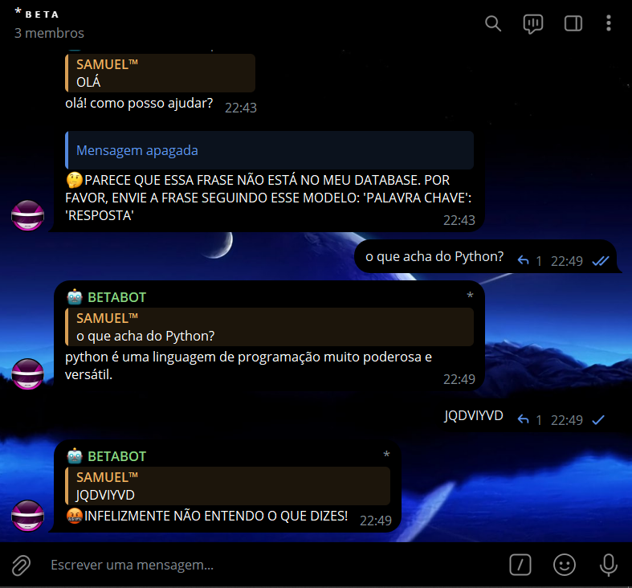

# CONVERSADOR LIVRE BOT:
🤩BOT DO TELEGRAM QUE CONVERSA NO GRUPO. MUITO SEMELHANTE AO ROBÔ ED.

 <br>

## DESCRIÇÃO:
Este bot é um assistente virtual básico projetado para interagir com os usuários de forma eficiente. Ao ser iniciado, o bot carrega automaticamente dois arquivos essenciais: "WORD.json" e "CONFIG.json". O arquivo "WORD.json" contém uma lista de palavras-chave e suas respostas correspondentes, permitindo que o bot responda a uma variedade de perguntas comuns e forneça informações úteis aos usuários. 

Por sua vez, o arquivo "CONFIG.json" define o comportamento do bot. Nele, as configurações podem ser ajustadas conforme necessário para personalizar a interação. 

O bot é capaz de compreender palavras-chave em uma frase completa, o que significa que não é necessário que a mensagem do usuário consista apenas na palavra-chave, mas pode ser uma parte dela dentro de uma frase. 

1. **Respostas a Perguntas Básicas:**
   - O bot pode responder a uma variedade de perguntas básicas, como nome, como está, o que pode fazer, entre outras.
   - Ele também pode fornecer piadas, curiosidades e recomendações sobre uma variedade de tópicos.

2. **Gerenciamento de Respostas:**
   - Se uma mensagem do usuário não corresponder a nenhuma resposta pré-definida, o bot pode solicitar ao usuário que forneça uma resposta para ser adicionada ao banco de dados.
   - Essa funcionalidade é controlada pelas configurações no arquivo "CONFIG.json".

3. **Erro de Mensagem não Compreendida:**
   - Se o bot não entender a mensagem do usuário, ele enviará uma mensagem indicando que não compreendeu e oferecerá orientações para reenviar a mensagem seguindo um formato específico.

## `CONFIG.json`:
### DESCRIÇÃO:
Aqui está uma descrição do que acontece quando cada chave no arquivo "CONFIG.json" está definida como "ON" ou "OFF":

| Chave   | Descrição                                 | Comportamento quando "ON"                            | Comportamento quando "OFF"                           |
|---------|-------------------------------------------|-------------------------------------------------------|-------------------------------------------------------|
| SEMPRE  | Sempre Responder                          | O bot responderá a todas as mensagens, independentemente se for mencionado via user (@). | O bot responderá apenas se for mencionado via user (@). |
| CRIAR   | Permitir Adicionar Respostas              | Os usuários poderão adicionar novas respostas ao banco de dados do bot. | Os usuários não poderão adicionar novas respostas.    |
| ERRO    | Ativar Mensagem de Erro                   | Se o bot não entender a mensagem do usuário, ele enviará uma mensagem indicando que não compreendeu e oferecerá orientações sobre como reenviar a mensagem seguindo um formato específico. | Se o bot não entender a mensagem do usuário, ele não enviará uma mensagem de erro e não oferecerá orientações para reenviar a mensagem. |

### PADRÃO:
Por padrão, eu configurei o arquivo "CONFIG.json" com as seguintes configurações:

```json
{
    "SEMPRE": "ON",
    "CRIAR": "OFF",
    "ERRO": "ON"
}
```

Significa o seguinte:

- **SEMPRE: "ON"**
  - Isso significa que o bot estará sempre pronto para responder a qualquer mensagem que receber no grupo, Mesmo que o user dele não seja mencionado.

- **CRIAR: "OFF"**
  - Com esta configuração, os usuários não poderão adicionar novas respostas ao banco de dados do bot. Isso significa que apenas as respostas pré-definidas no arquivo "WORD.json" serão reconhecidas e respondidas pelo bot.

- **ERRO: "ON"**
  - Isso indica que o bot está configurado para enviar uma mensagem de erro quando não entender a mensagem do usuário.

Essas configurações permitem controlar o comportamento do bot de acordo com suas necessidades e preferências. Ajuste as configurações conforme desejado para personalizar a experiência do bot de acordo com sua necessidade.

## EXECUTANDO O PROJETO:
1. **Coloque o Token:**
   - Antes de executar o bot, é necessário substituir pelo seu token no arquivo `TOKEN.py`, o qual pode ser obtido por meio do [@BotFather](https://t.me/BotFather). Certifique-se também de que todas as dependências estejam instaladas em sua máquina. Se você não estiver familiarizado com esses passos, confira nosso [curso completo sobre a criação de bots no Telegram](https://github.com/VILHALVA/CURSO-DE-TELEGRAM-BOT) para obter orientações detalhadas.

2. **Inicie o Bot:**
   - Execute o bot do Telegram em Python iniciando-o com o seguinte comando:
```bash
   python MAIN.py
```
   - Inicie o bot enviando o comando `/start`. Receba uma mensagem de boas-vindas e Converse.

## SAIBA MAIS:
- [PROJETO CRIADO PELO VILHALVA](https://github.com/VILHALVA)
- [FAÇA O CURSO DE TELEGRAM BOT](https://github.com/VILHALVA/CURSO-DE-TELEGRAM-BOT)
- [FAÇA O CURSO DE JSON](https://github.com/VILHALVA/CURSO-DE-JSON)
